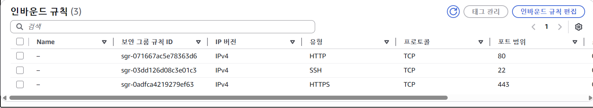

# 입실 체크 !

# 본시 수업 - Domain 개념
## 현재 수업 상황에서 복습에서 삭제하라고 했던 EC2 다시 살려서 탄력적 IP 연결까지 완료함. (흐름은 다르게 가져감)

## 필수 개념 수업
### 도메인(Domain)
naver.com / youtube.com 과 같이 **문자로 만들어진 컴퓨터 주소**를 의미함.
저희 IP 개념을 배웠으니, IP도 컴퓨터 주소였지만 걔는 숫자로 이루어진거고,
얘는 문자열을 만든 다음에 저희 IP 주소와 매핑을 시켰다고 볼 수 있음.

1. 서브 도메인 (Sub Domain)
방금 naver 기준으로 확인했듯이 naver.com도 있고 map.naver.com / search.naver.com과 같은
주소를 확인할 수 있음. 즉, `_.naver.com` 형태의 도메인을 서브 도메인이라고 칭함.
그리고 그 정의는 **하나의 도메인 _아래_ 에서 여러 서브시를 구분하여 관리** 할 때 사용함.
서브 도메인은 각각 따로 구매하는 것이 아닌 naver.com 하나 구매하면 모든 서브 도메인이 이용 가능함.

- 실무에서의 서브도메인 활용 방안
  - 서브 도메인은 메인 웹 사이트, 관리자 웹 사이트, 백엔드 서버 등의 구성 요소를 구분하기 위해 활용하는 편임.
    예를 들면, maybeags.kr이라고 하는 도메인을 구매했다고 가정했을 때, 메인 웹 페이지 사이트는 maybeags.kr이고,
    관리자용 웹 사이트 도메인은 admin.maybeags.kr이고, 백엔드 서버의 도메인으로는 api.maybeags.kr이 되는 방식

### 웹 서비스에 도메인을 적용하는 이유
웹 사이트는 데이터를 받아오기 위해 백엔드의 api와 통신하는 경우가 많음.
그러면 EC2로 올리는 것까지 배웠으니 그냥 탄력적 IP로 받아오면 되지 않나 라고 생각할 수 있음.
근데 실무에서는 대부분 도메인 주소로 연결해줌.
일단 기억하기 쉬움.
더 중요한 실무적 이유로는 HTTPS 적용을 하기 위해서임.
일반적인 IP 주소로는 HTTPS를 적용할 수 없으므로 실무에서 서비스 운영할 때는 도메인 적용이 사실상 필수임.

### DNS (Domain Name System)
**도메인 주소를 IP 주소로 변환하는 시스템** : 사람은 문자열 주소값을 더 잘 외울 것이고,
                                     컴퓨터는 IP 주소를 더 잘 처리하니까 중간에 변환해주는 체계
                                     → DNS임


1. DNS 레코드


https://내도메인.한국
https://cloud-information.tistory.com/11
이상의 사이트로 접속하여 내도메인.한국 signup

- 내도메인.한국의 경우 서브도메인에다가 A 레코드를 적용할 수 있기에 
  백엔드 서버에 API 서브도메인을 달아줌.

## ELB 이해하기
### HTTP vs HTTPS
저희가 RESTful API에서 공부했던 것처럼 대부분의 웹 사이트는
HyperText Transfer Protocol이라는 방식으로 서버와 데이터를 주고 받음.
(그리고 그 중개 역할을 하는 데이터 폼이 JSON이었음).
HTTP는 주고 받은 데이터를 암호화하지 않기에 중간에 데이터를 가로채는게 가능함.
예를 들어 로그인하려고 했을 때 아이디와 비밀번호를 백엔드 서버로 보내게될텐데,
크래커가 이를 가로채는 게 가능했겠음.
우리는 암호화를 백엔드에서 DB로 보낼 때만 했었음

이상의 보안 문제를 해결하기 위해 개발된 것이 HTTPS임.

### HTTPS 적용 이유
1. 보안 강화 : HTTPS 적용을 하면 데이터를 암호화해서 통신하기에 작업이 필요함.
             백엔드 서버의 주소도 HTTPS 인증을 받아야 함.
             따라서 데이터를 안전하게 주고받을 수 있도록 FE-BE 서버 모두 HTTPS를 적용

2. SEO (Search Engine Optimization) : 구글이나 네이버 같은 검색 엔진에서 
                                      HTTPS 적용하면 상위 노출 점수를 좀 더 줌.

3. 사용자 이탈 방지 : 주소창 좌측 보시면 HTTPS 적용 안되어있으면 크롬에서 wran 띄움.
                  신경 쓰시는 분도 있고 아닌 분도 있음.

### ELB (Elsatic Load Balancing)
AWS에서 제공하는 로드 밸랜서 서비스를 의미함.
그러면 로드 밸런서가 뭐냐면 트래픽을 여러 서버에 걸쳐 분산하는 장치로,
특정 서버에 트래픽이 집중도니느 것을 방지하고,
장애가 발생하더라도 정상적인 서버로 트래픽을 전달할 수 있도록 함.
즉, 같은 역할을 하는 서버를 2대 이상 복수로 운영하는 경우 안정된 서비스를 제공하기 위해 ELB를 도입
또한 ELB에서는 특정 포트에서 HTTPS 요청을 처리하도록 설정할 수 있으므로 보안이 필요한 웹사이트나
API 서버에서도 많이 사용하게 됨. (그래서 HTTPS 배우면서 ELB가 단원으로 함께 구성했음)

### ELB 구성요소
1. 리스너 (Listener) : ELB로 들어오는 요청을 어떻게 처리할지 결정하는 규칙.
                     특정 포트와 프로토콜을 이요아여 클라이언트의 요청을 기다리고,
                     해당 요청을 ELB에서 설정된 규칙에 따라 적절한 _대상 그룹_ 으로 전달
                     예를 들어, HTTPS 프로토콜을 사용하는 리스너 443 포트에서 보안 연결을 통해
                     들어오는 트래픽을 받아서 암호화된 상태로 처리해줌.
                     리스너를 잘못 설정하면 요청을 올바른 대상 그룹으로 전달하지 못하므로 리스너 설정에 주의해줘야 함.

2. 대상 그룹 (target group) : ELB가 수신한 트래픽을 전달할 서버들의 집합을 의미함.
                            즉, ELB로 들어온 요청을 어디로 보낼지 결정해야 하는데,
                            그 어떤 곳들을 대상 그룹이라고 볼 수 있음.
                            즉 ELB에 EC2 인스턴스를 추가한다면 ELB는 들어온 요청을
                            EC2 인스턴스로 전달해주게 됨.
                            근데 EC2에 오류 발생해서 서버가 멈췄다고 가정해보겠음.
                            그러면 보내봤자 쓸모 없을거기에 ELB는 대상 그룹 내에 있는
                            EC2 인스턴스들이 살아있는지 확인하기에 주기적으로 요청을 보내봄.
                            그 때 200 OK가 리턴됨녀 살아있다고 보고 요청을 해당 인스턴스에 보내게 되고,
                            만약 200 OK가 리턴되지 않는다면 그 인스턴스에는 요청을 보내지 않는
                            **상태검사**도 수행해주는 기능이 있음.
                            대상 그룹을 만들 때 상태 검사를 할 경로와 포트를 지정함.

ELB 개념 이미지


## nginx를 도입하여 HTTPS 적용하기
- 현재 server port 80으로 잡아놨는데, nginx가 80을 점유함.
  그래서 springboot의 server port를 8080으로 수정해야할 것 같음


보안 규칙 80으로 잡혀있음.
그런데 application.yml을 8080으로 수정했으니 이부분이 문제

그런데 위에서 설명한것처럼 80포트를 통해서 바로 EC2로 들어가는 게 아니라 먼제 nginx를 통해서
들어오게 될 것임. 그러면 보안 규칙 상 80은 열려있으니까 nginx까지는 들어가게 될거고,
nignx에서 8080으로 보내줄거기에 aws상의 EC2 보안 규칙에 위배되지 않음

`sudo apt install -y nginx`후, `nginx -v`

그 다음 이하의 명령어를 실행
`sudo tee /etc/nginx/sites-available/springboot` : Springboot 프로젝트를 Nginx 설정 파일을 생성하는 명령어
- /etc/nginx/sites-available/ 경로에 springboot라는 이름의 설정 파일을 생성한다는 의미
- sudo tee : 사용자 권한이 필요한 디렉토리에 대고 내용을 직접 덮어쓰도록 작성.
- 그리고 엔터를 치니 아무런 메시지가 없고 커서 깜빡거림.
  이제 이 이후에 쓰는 내용의 입력을 기다리는 입력상태가 됨

- `sudo nano /etc/nginx/sites-available/springboot`

    - sudo : 관리자 권한으로 실행
    - nano : 리눅스에서 텍스트 편집할 때 텍스트 편집기로 쓰겠음


```
server {
  listen 80;
  server_name api.rjsdyd-springboot.p-e.kr;
  
  location / {
    proxy_pass http://localhost:8080;
    proxy_set_header Host $host;
    proxy_set_header X-Real-IP $remote_addr;
    proxy_set_header X-Forwarded-For $proxy_add_x_forwarded_for;
    proxy_set_header X-Forwarded-Proto $scheme;
  }
}
```

ctrl + x : 저장할건지 물어봄 → Y → enter 키 쳐서 원래 터미널로 복귀

```bash
sudo ln -s /etc/nginx/sites-available/springboot /etc/nginx/sites-enabled/
sudo rm -f /etc/nginx/sites-enabled/default
sudo nginx -t && sudo systemctl restart nginx
```

1. sites-available 에 있는 springboot 파일을 sites-enabled로 심볼릭 링크(바로가기)를 만들어 줌.
  - 이유 : Nginx가 sites-available에 있는걸 그대로 실행 못시키고 enabled에 있는 파일만
          읽어서 서버를 돌리기에(보안 문제)... 원본은 sites-available이라는 원본 보관소에 두고,
          필요할 때만 바로가기를 통해 해당 설정을 쓰겠다는 의미로 볼 수 있음.

2. /etc/nginx/sites-enalbed 경로에 default라는 파일이 있음. Niginx 기본 설정이라고 볼 수 있는데,
   얘를 삭제해서 우리는 springboot(파일명) 설정을 쓰겠다는 뜻.

3. sudo nginx -t : 오타나 문법 상 오류 없는지 테스트
  - sudo systemctl restart nginx : ngix 리스타트

## NginX
Springboot 실행할 때 유심히 보셨거나, 전공자분들은 Apache를 보신 적이 있을 것임.
Nginx는 웹 서버이지 클라이언트 요청을 백엔드로 연결시켜주는 리버스 프록시 서버에 해당함.
손님과 주방 사이에서 주문을 효과적으로 관리하고 음식을 서빙하는 애

### 사용 이유
1. 리버스 프록시 : 보안을 위해 사용자가 실제 애플리케이션 서버에 직접 접근하지 못하게 막고,
                지가 받아가지고 토스해주는 역할을 함.

2. 로드밸런싱 : ELB라는 것은 AWS에서의 서비스 명이고 load balancing 개념 자체는 다른 데서도 쓰임.
             접속자가 너무 많을 때 여러 대의 서버로 요청을 분산시켜서 서버 다운을 방지하고,
             서버 다운 되면 다른 데로 보내주는 등의 역할
    
3. 정적 파일 처리 : 기본적으로 static 폴더 내에 있는 HTML / CSS / 이미지 등에 있는 변하지 않은 
                 정적 파일들을 애플리케이션 서버를 거치지 않고 직접 응답시켜줘서 효율을 높일 때 사용.
                 (resources/static 이라고 건드린 적이 있음 → 근데 우리는 react 써서 상관 없음)
                
4. SSL (HTTPS) 설정 : 보안 인증서 적용 작업을 nginx 내에서 처리할 수 있음

### 기본 서버(Spring(boot)의 Apache)와의 차이점
- nginx는 비동기 이벤트 기반 방식을 사용하여 효율성을 높이고 이상에서의 특징들을 적용할 수 있기에 최근에 채용.
  다만 초반 설정 때문에 SpringBoot의 기본 Web Server는 여전히 Apache임

### 이제 현재 nginx가 적용되어 있는 상태에서 http:// 요청이 들어가는지 체크.

### HTTPS 적용
Certbot 설치 + HTTPS 발급
Certification bot
```bash
sudo snap install --classic certbot
sudo ln -s /snap/bin/certbot /usr/bin/certbot
sudo certbot --nginx -d api.rjsdyd-springboot.p-e.kr
```

1. sudo snap install --classic certbot : snap 패키지 매니저를 통해서 certbot 프로그램 설치
  - certbot : 무료 SSL 인증서를 발급해주고 nginx 설정을 _자동 수정_ 해서 HTTPS를 적용시켜줌
              --classic은 시스템 접근 권한 준다는 뜻

2. sudo ln -s /snap/bin/certbot /usr/bin/certbot : 두 개의 경로 적힌 것에서 볼 수 있듯이 
                                                   실행 파일을 /usr/bin으로 바로가기 만드는 것.
  - 터미널 어느 링크든지간에 상관없이 certbot 명령어 실행시킬 수 있도록 바로가기 만드는 것.

3. sudo certbot --nginx -d api.rjsdyd-springboot.p-e.kr : sudo 권한으로 certbot 실행시키는데,
                                                          `--nginx`를 통해서 nginx 설정 파일을
                                                          **알아서 HTTPS로 수정해라**는 의미.
                                                          `-d 도메인 주소`는 인증서 받을 도메인 주소를 지정.