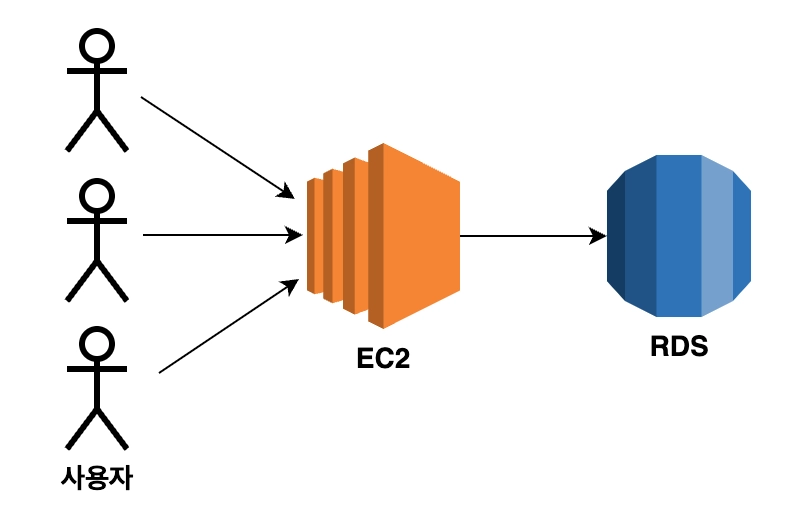
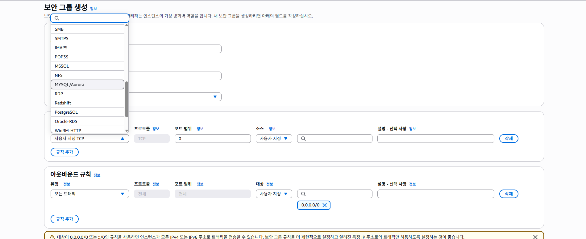
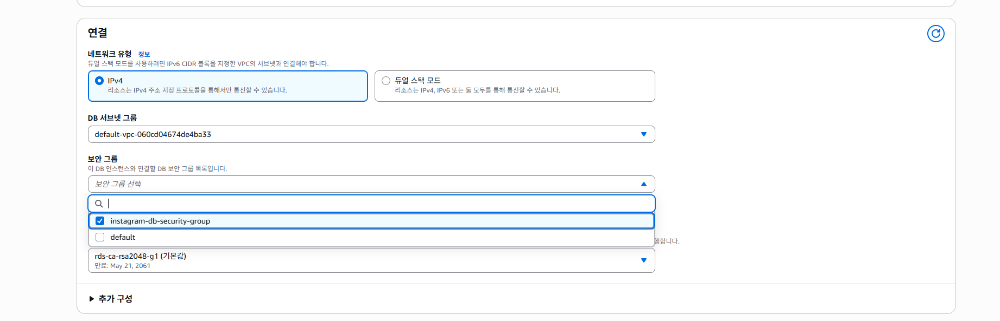
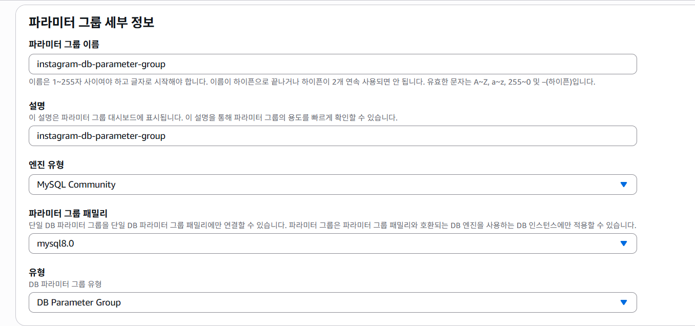
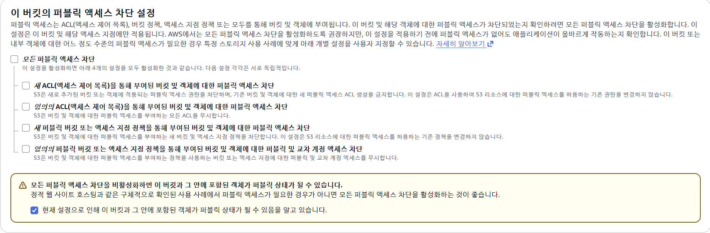

# 입실 체크

# 복습 내용
1. EC2 인스턴스 생성
- Java 설치
- SpringBoot Project를 clone
- Nginx 설치
- Certbot 설치

2. 탄련적 IP 발행
  - EC2 인스턴스와 연결

3. 도메인 발급
  - 서브도메인과 탄력적 IP

Clone 까지만 했을 경우 http로 접속이 가능
탄력적 IP 발급했을 경우 동일한 IP 주소로 접속 가능
도메인 발급하시면 문자열 주소값으로 접속 가능
Nginx - Certbot까지 적용하시면 https 접속이 가능

# RDS 란?
Relational Database Service의 축약어로 AWS 상에서
**관계형 데이터베이스를 빌려서 사용할 수 있는 서비스**.
내부에 MySQL/MariaDB도 있고, PostgreSQL 등 다양한 DB를 제공하며,
사용자가 원하는 유형을 선택해서 사용할 수 있음.
DB를 안정적으로 유지보수할 수 있도록 백업 / 업데이트 / 자동 확장 기능을 제공.

## RDS 인스턴스
AWS로부터 빌린 DB가 설치되어있는 컴퓨터 한 대를 RDS 인스턴스라고 합니다. EC2와 같습니다.
- 아니 우리는 localhost로 실행할 때 컴퓨터 한 대에서 backend 서버와 DB를 동시에 돌렸는데, 
  그 말은 EC2 내부에 DB를 설치해서 사용하는 방법이 있지 않을까요? -> 가능.
- 이유는 이하에서 설명하겠습니다.

RDS는 이하의 세 가지 옵션을 설정할 필요가 있습니다.
1. 엔진 유형 : DB 종류라고 생각하면 편합니다. 주요 데이터베이스의 엔진은 MySQL, MariaDB, Amazon Aurora 등.
2. 인스턴스 클래스 : 컴퓨터 성능을 의미합니다. 우리는 프리티어쓰겠지만 EC2에서의 인스턴스 유형과 유사한 의미.
3. 스토리지 : RDS 인스턴스도 컴퓨터이기 때문에 저장 공간이 존재합니다. EC2와 용어 동일.

## RDS를 사용하는 이유
1. EC2로 백엔드 배포를 하고, DB는 본인 컴퓨터에 설치해서 쓰는 방법도 가능.
2. EC2에 백엔드 및 DB를 배포하는 방법
  - 반드시 RDS를 활용할 필요는 없습니다. 토이 프로젝트의 경우에는 가능할 것 같습니다
    (대신 create-drop 해두면 더미 데이터를 미리 많이 CommandLineRunner를 통해 집어넣어둬야겠네요). 
    실무에서는 권장하지 않습니다. 
    만약에 백엔드 서버에 장애 발생 시에 EC2인스턴스에 이상이 생길 경우 DB도 영향을 받을 수 있기 때문입니다.

## 저희 RDS 적용 아키텍쳐 구성


## RDS 인스턴스 생성

- public access를 Yes로 잡았습니다. 
  개발 환경이나 로컬에서 RDS에 접근할 수 있도록 했습니다.
- 나머지는 free tier로 잡아놨고,
- 마스터 ID 및 패스워드 설정을 했습니다.

## RDS 보안그룹 설정
- EC2로 가서 보안그룹으로 들어갑니다.


## RDS Parameter group setting


1. 이하의 속성들 전부 utf8mb4 로 설정하기.
  - character_set_client
  - character_set_connection
  - character_set_database
  - character_set_filesystem
  - character_set_results
  - character_set_server
2. 이하의 속성들 전부 utf8mb4_unicode_ci 로 변경하기 - unicode_ci : 정렬 / 비교 방식을 명시
  - collation_connection
  - collation_server
3. time_zone 속성을 `Asia/Seoul`로 변경하시오.


- DB 파라미터 그룹을 변경한 후에는 RDS를 재부팅해야만 정상 적용이 됩니다
  (근데 우리 이거 생성하는데 시간 걸렸기 때문에 빠르게 나갔습니다).

## RDS로 접속하기
- 여러분 컴퓨터에 DBeaver 설치 여부 확인 -> 안되어있으면 설치하겠습니다.
- SQL 학습할 때 있었으니까 SQL repository 내에 있겠네요.

- instagram-db 인스턴스로 들어가서 연결 부분을 엔드포인트로 지정했습니다.
- dbeaver 켠 다음에 데이터베이스 연결 -> 
  MySQL 선택 후에 server name에 aws의 엔드포인트를 붙여넣었고, 
  username / password를 인스턴스 설정 시 만들었던 
  master id 와 master password를 입력했습니다.

- 그러니까 public key 요구가 있었습니다. 이하는 그 해결 방법입니다.
```
해결 방법: 연결 속성 수정
DBeaver 좌측 상단의 'Database Navigator'에서 해당 데이터베이스 연결 아이콘에 마우스 오른쪽 클릭을 합니다.
편집(Edit Connection) 또는 설정 메뉴를 선택하세요.
설정 창이 뜨면 [Driver properties] (드라이버 속성) 탭으로 이동합니다.
리스트에서 다음 두 항목을 찾아 값을 변경해 주세요. (우측 상단의 검색창을 이용하면 편합니다.)
allowPublicKeyRetrieval: 이 항목의 값을 false에서 **true**로 변경합니다.
```
- EC2 인스턴스 생성했습니다. instagram-rds-server / key pair / security group 생성하고 연결했습니다.
- 연결로 들어가서 -> java 설치했습니다.

git clone https://github.com/maybeags/rds_springboot_sample.git

클론 이후에 application.yml 파일 수정을 했습니다.
```bash
cd rds_springboot_sample/src/main/resources`
vi application.yml
```
까지 해서
들어가면 `i`눌러서 insert 모드로 들어간 다음에
```yml
server:
  port:8080
spring:
  datasource:
    url: jdbc:mysql://여러분엔드포인트:3306/instagram
    username: admin
    password: 여러분비밀번호
    driver-class-name: com.mysql.cj.jdbc.Driver
  jpa:
    hibernate:
      ddl-auto: update
    show-sql: true
```
수정하고 esc 누르고 `:wq`해서 저장하고 나왔습니다.

```bash
cd ../../../
chmod +x gradlew
./gradlew clean build
```
로 build 과정까지 들어갔습니다. 현재 로딩 중


그러면 빌드 다 됐다는 전제 하에 할 행동이
```bash
cd build/libs
sudo java -jar aws-rds-springboot-0.0.1-SNAPSHOT.jar  # 이번에는 이렇게 실행 안시키고
sudo nohup java -jar aws-rds-springboot-0.0.1-SNAPSHOT.jar  # 얘는 저희가 터미널 꺼도 계속 켜져있도록 하는 명령어 nohup이 포함되어있습니다.
```

- 이상의 `nohup`을 사용하게 되면 터미널을 나가더라도 
  백그라운드에서 여전히 실행되고 있어
  (즉, port를 점유하고 있어) 
  다시 빌드하고 재실행을 시키려고 할 때 포트 점유 로그가 뜨면서 실행이 되지 않을 수 있습니다.

```bash
sudo lsof -i:8080   # 8080 포트에서 실행되는 프로세스 확인 -> PID
sudo kill {PID 값}  # 여기서 8080 포트에서 실행되는 프로세스를 강제 종료합니다.

# 그다음 빌드합니다
# 그리고 nohup 실행합니다

sudo lsof -i:8080   # 그랬는데 8080 포트 점유하고 있는 프로세스가 있다면 신규 버전이 실행된거라고 해석할 수 있습니다.
```


- application.yml을 확인합니다 -> 혹시 port가 80인지 8080인지 확인합니다.
- 80이다? -> 보안 그룹이 8080인지 확인할 것 -> 인바운드 보안규칙 수정 -> HTTP 설정으로 80 포트 열어줍니다. 
- 8080이다? -> 보안 그룹이 80인지 확인할 것 -> 인바운드 보안규칙 수정 -> 사용자지정 TCP로 8080 포트를 열 것.

## 안전 삭제 
- EC2 - RDS 간의 연결은 : application.yml을 통해서만 이루어져있고 인스턴스 추가 등 AWS에서 설정한 적이 없습니다.
- RDS 삭제를 시도하면 자동 백업 어쩌고 하는데 이러면 삭제하고나서도 돈 나감.
- RDS를 삭제 했다면 -> Security Group / Parameter Group

근데 삭제하는데 시간이 좀 걸리니까 EC2를 먼저 삭제하겠습니다.
- 그러면 여기에 딸려있는 애들도 삭제 가능하겠네요 -> Security Group / Key Pair / 탄력적 IP

나머지 다 삭제하면 금일 수업 내용이 끝납니다.

내일 뭐하냐면

EC2 생성 -> springboot 프로젝트 clone 받을겁니다(여기서 8080으로 수정할 필요 없습니다)
RDS 생성 -> DBeaver로 로컬 DBMS와 AWS RDS 간의 연결 형성
springboot project와 RDS를 연결해줍니다.
탄력적 IP 발급 받습니다 -> springboot project와 연결
도메인 발급 받습니다 -> 탄력적 IP와 연결해줍니다.
EC2 내부에 nginx 설치합니다.
그리고 CertBot 설치합니다.
https 설정합니다.

------------특정 상황 이후에 제가 postman을 통한 /boards 엔드포인트로 요청한거 재현했습니다. 어디까지 완성하면 가능한지도 꼭 고민해볼 것.

git add .
git coomit -m "feat: 20260325 RDS"
git push