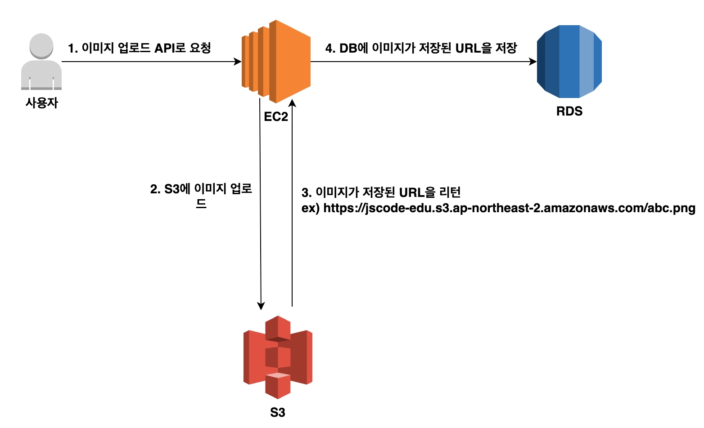
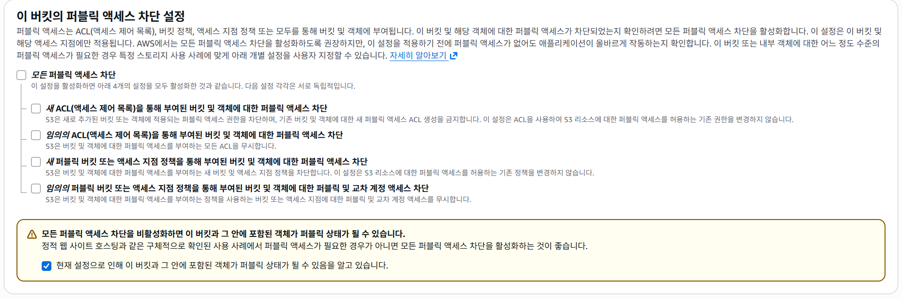
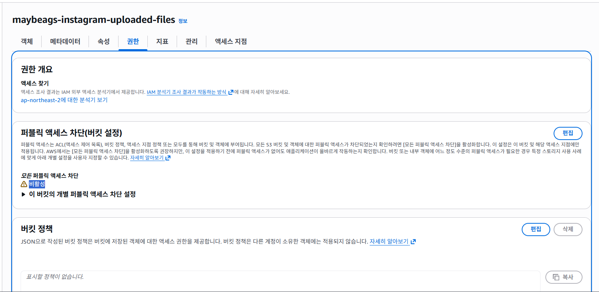
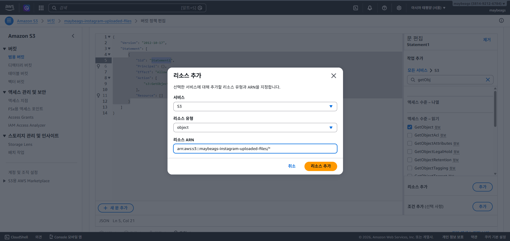
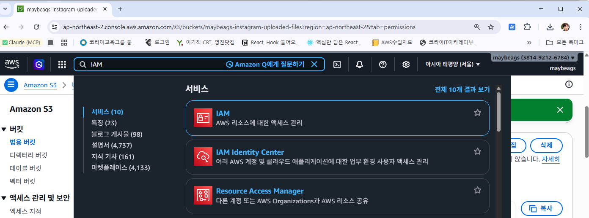
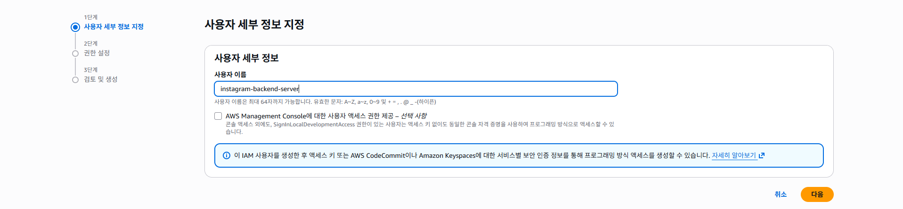
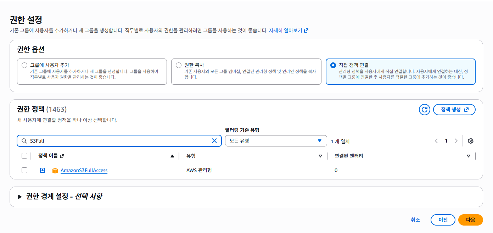
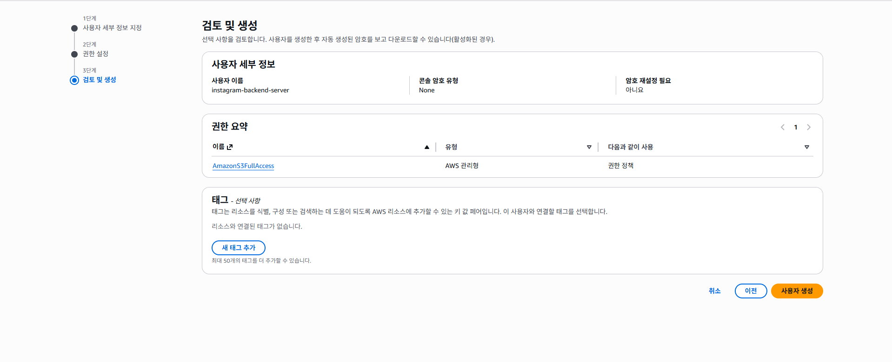
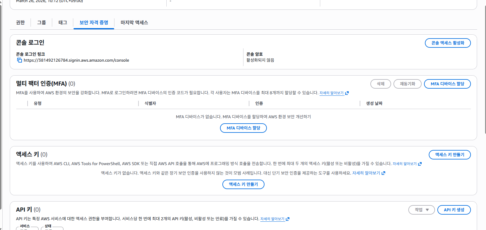
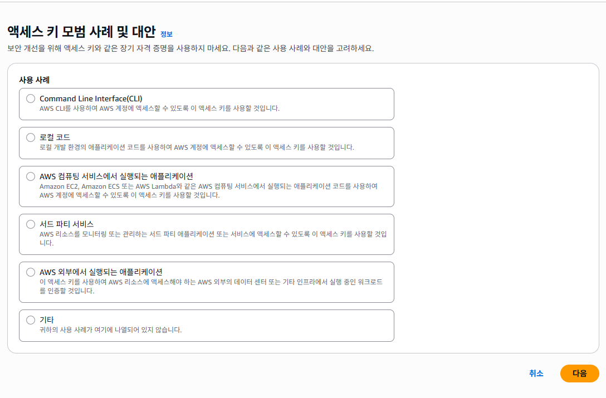

# 입실 체크!
# S3 이해하기
Backend 서버에서 이미지나 문서 같은 파일을 저장하고 관리하는 안정적인 저장소가 요구될 수 있음.
AWS에서는 이런 '파일 저장소'로 S3를 많이 활용함.

## S3
AWS에서 제공하는 파일 저장 서비스 이름.
폰으로 사진 찍으면 구글 드라이브나 아이클라우드에 저장되는데,
그거랑 유사한 개념임.
1. 버킷 : 구글 드라이브에서 공유 드라이브를 만들 수 있는 것처럼 S3에서도 저장소를 여러개 만들 수 있음.
         이렇게 만들어진 저장소를 버킷(bucket)이라고 함.
2. 객체 : S3에서는 버킷에 업로드한 **파일을 객체**라고 함.
         이 객체는 key-value pair로 이루어져있음. 
         키는 객체에 할당한 이름, 값은 업로드한 컨텐츠 자체를 의미함.
         객체의 값은 바이트 형태로 고정.

## S3를 사용하는 이유
보편적으로 사용되는 분야는 이미지 업로드 기능.
업로드된 이미지 파일은 백엔드 서버가 실행되는 EC2 인스턴스 내부에 저장하는 것도 가능하지만,
파일 개수가 많아지면 관리가 어려움.
파일 저장할 공간이 한정되어 있고, RDS 때와 마찬가지로 EC2 인스턴스에 이상이 생길 경우 데이터 손실 문제도 있기에...
- S3는 파일 용량에 제한이 없고 사용자의 필요에 따라 자동으로 확장.
  또한 데이터를 여러 물리적 위치에 분산하여 저장하기에 데이터 손실 확률이 0.000000001%로 매우 희박함.

## 이미지 업로드 과정


## 이미지 다운로드 과정


## S3 버킷 생성
특히 퍼블릭 액세스 관련에서
 
퍼블릭 엑세스란 익명의 사용자도 S3의 객체를 다운 받을 수 있게끔 한다는 의미.
사용자들이 웹 브라우저에서 S3에 있는 이미지를 볼 수 있게 하려면 다음과 같이 퍼블릭 액세스를 차단 설정을 모두 해제
그리고 차단을 해제하면 객체가 퍼블릭 상태가 된다는 점을 안내하는 warn이 뜨게 되는데,
이번 예제에서는 이미지를 모든 사용자에게 공개하는 것이 목적이기에 퍼블릭

# 버킷 사용을 위한 정책(Policy) 설정하기
AWS에서 S3 버킷을 포함한 자원을 생성하면 기본적으로 모든 권한이 차단되어 있음.
즉 이미지를 업로드하더라도, 
별도로 권한 설정을 하지 않으면 다른 사용자들은 버킷 내에 있는 객체에 접근하는 것이 불가능하다는 의미가 되겠음.

AWS에서는 정책을 활용하여 특정 자원에 접근할 수 있는 권한을 부여할 수 있음.
- 정책(Policy) : 권한(Permission)을 정의하는 JSON 문서.
  이상의 정책 개념을 활용하여 특정 사용자 또는 서비스가 S3 버킷의 파일을 읽거나 수정할 수 있도록 설정이 가능함.


- 에서 권한 -> 정책 -> 편집 버튼 클릭
- 현재 저희의 권한 설정 목표는 모든 사용자가 해당 버킷의 모든 객체에 접근할 수 있도록 함.



* ARN : Amazon Resource Number의 축약어로 **AWS에 존재하는 리소스를 표현하는 문법**

최종 정책은 현재 이하와 같음.
```json
{
    "Version": "2012-10-17",            # 정책을 작성하는 문법의 버전
    "Statement": [
        {
            "Sid": "Statement1",        # 정책끼리 구별하기 위한 식별값
            "Effect": "Allow",          # 이하의 기재된 권한을 '허용'한다는 의미
            "Principal": "*",           # 권한을 부여할 대상
            "Action": "s3:GetObject",   # 파일 내려 받기
            "Resource": "arn:aws:s3:::maybeags-instagram-uploaded-files/*"
                        # maybeags-instagram-uploaded-files 버킷에 있는 모든 파일 대상
        }
    ]
}
```

# IAM으로 S3 사용 권한 준비
이상에서 버킷 정책으로 이제 사용자들은 S3에 저장된 파일을 내려받을 수 있음.
그런데 Backend server는 사용자가 아니기 때문에 여전히 S3에 접근하는 것이 불가능함.
백엔드 서버는 AWS SDK(Software Development Kit)라는 라이브러리를 사용해 S3와 같은 AWS 서비스에 요청을 보내는데, 
이때 서비스에 접근할 수 있는 권한이 필요하기에...
AWS SDK는 IAM이라는 서비스에서 부여한 권한을 바탕으로 AWS 자원에 접근할 수 있음.
즉 백엔드 서버가 S3에 접근할 수 있도록 적절한 권한을 가진 IAM 사용자를 먼저 만들어야 함.

## IAM
Identity and Access Management의 축약어로, 
AWS 자원에 대한 접근 권한을 제어하는 서비스. 
이를 이용해서 사용자에게 필요한 권한만을 부여할 수 있음.

1. IAM 사용자
  - IAM에서 '사용자(user)'는 특정 권한이 부여된 출입증 정도로 생각하시면 편함.
    예를 들어 A라는 개발자에게는 EC2에만 접근을 허용하고, B에게는 RDS에만 접근을 허용하고 싶다고 가정하겠음.
    해당 경우에 A 개발자와 B 개발자에게 부여해야하는 권한이 서로 다름.
    그러므로 A 개발자용 출입증과 B 개발자용 출입증을 각각 만들어야 함.
  - IAM에서 '사용자'는 사람뿐만 아니라 특정 컴퓨터 또는 특정 프로그램에 부여하는 출입증으로 쓰이기도 함.
    이번 예제에서는 백엔드 서버가 S3에 접근할 수 있는 권한을 부여하기 위한 IAM 사용자를 생성할 것임.

## IAM 사용자 생성 및 액세스 키 발급 받기

이상의 이미지에서 AmazonS3FullAccess는 영단어를 통해서 S3 버킷에 대한 전체 접근을 허용한다고 볼 수 있겠음.
권한 분리는 프로젝트별로 다르게 부여될 수 있음.







- 이상의 이미지에서 액세스 키 모범 사례 및 대안 파트를 좀 확인하겠음.
  `AWS 컴퓨팅 서비스에서 실행되는 애플리케이션`
  Amazon EC2, Amazon ECS 또는 AWS Lambda와 같은 AWS 컴퓨팅 서비스에서 
  실행되는 애플리케이션 코드를 사용하여 AWS 계정에 액세스할 수 있도록 이 액세스 키를 사용할 것임.

저희는 EC2를 쓸거기 때문에 `AWS 컴퓨팅 서비스에서 실행되는 애플리케이션`을 쓸 수도 있고,

`AWS 외부에서 실행되는 애플리케이션`
이 액세스 키를 사용하여 AWS 리소스에 액세스해야 하는 AWS 외부의 데이터 센터 또는 기타 인프라에서 실행 중인 워크로드를 인증할 것임.

`AWS 외부에서 실행되는 애플리케이션`를 쓸 수도 있음.